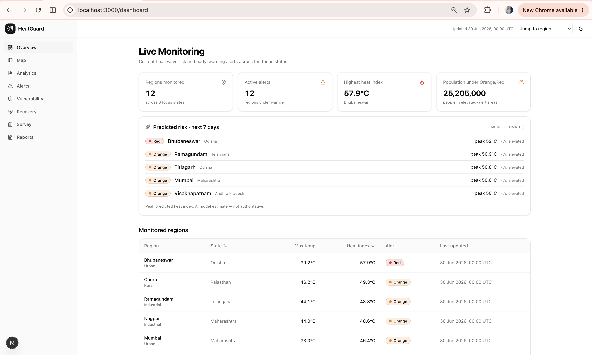
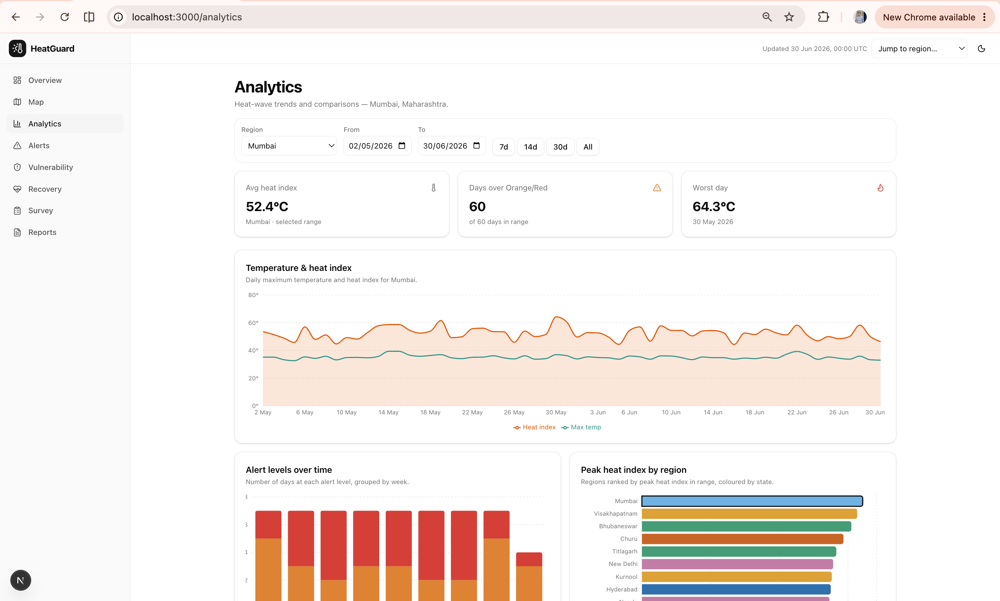
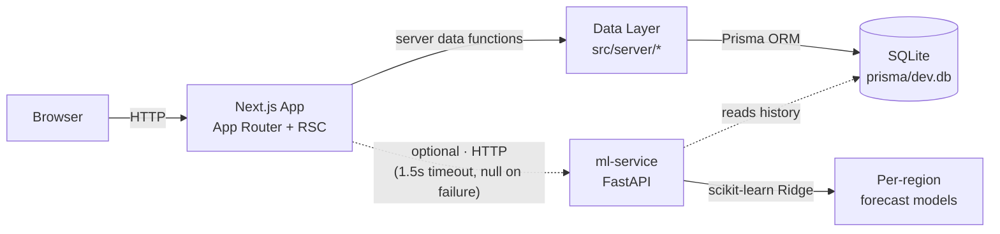

<div align="center">

# 🔥 HeatGuard

**Heat-wave disaster management & early warning for India — monitor risk, warn early, protect the vulnerable, track recovery.**

<p>
  <a href="https://nextjs.org"></a>
  <a href="https://www.typescriptlang.org"></a>
  <a href="https://www.prisma.io"></a>
  <a href="https://tailwindcss.com"></a>
  <a href="https://maplibre.org"></a>
  <a href="https://fastapi.tiangolo.com"></a>
  <a href="https://scikit-learn.org"></a>
  <a href="https://www.docker.com"></a>
  <a href="./LICENSE"></a>
</p>

</div>

---

## What & why

Heat waves are one of India's deadliest and most under-managed natural hazards: each pre-monsoon season brings prolonged extreme heat that strains public health, agriculture, water, and power — hitting the elderly, outdoor workers, and children hardest. **HeatGuard** is a decision-support platform for district administrators and disaster-management teams that turns raw temperature telemetry into IMD-style early warnings, maps hotspots, scores population vulnerability, tracks post-event recovery, and generates shareable reports. It runs **fully offline on seeded data**, with an optional AI service adding short-range forecasts — clearly labelled as **model estimates, not authoritative predictions**.

> **Focus states (v1):** Telangana · Andhra Pradesh · Odisha · Rajasthan · Maharashtra · Delhi.

---

## Screenshots

> 📷 Placeholder images — drop real captures into [`docs/screenshots/`](docs/screenshots/) (see the note there).

|                       Overview                       |               Interactive map                |
| :--------------------------------------------------: | :------------------------------------------: |
|  |  |
|                    **Analytics**                     |           **Early-warning alerts**           |
|   |   |
|                 **Generated report**                 |                                              |
|         |                                              |

---

## Features

Organised around the project's four pillars — each maps to a live module.

### 🌡️ Response — real-time monitoring & alerts

- Live monitoring dashboard with per-district heat index, current level, and vulnerability.
- Interactive **GIS hotspot map** (MapLibre, no API token) with alert-level and vulnerability overlays.
- **IMD-style early warnings** — Normal / Yellow / Orange / Red — with a system status code, alert simulator, and optimistic acknowledge.

### 🏥 Recovery — post-event indicator tracking

- Tracks hospital admissions, workdays lost, crop losses, electricity failures, and water scarcity per district over time.

### 📈 Future Challenges — trend analysis

- Historical temperature/heat-index trends, alert-level distribution, and cross-region comparison for urban heat islands and water stress.

### 🛰️ Role of Technology — GIS & AI intelligence

- Transparent, weighted **composite vulnerability index** with per-region "why" explanations and an at-risk intersection.
- Optional **AI forecasts** (7-day heat & health-risk per region) from a FastAPI + scikit-learn service — _model estimates, not authoritative_.
- Auto-generated 10-chapter **report** with charts, a map snapshot, and **server-side PDF export**.

Plus a **Field Survey** module (heat-awareness data collection with CSV export) feeding into the recovery picture.

---

## Architecture

Two independent processes. The Next.js app is the system of record; the ML service is a stateless, optional consumer of the same seeded database.



Server components call `src/server/*` directly; client components use a typed API client against `src/app/api/*`; all heat/risk math lives in pure, unit-tested functions under `src/lib/heat/*`.

---

## Tech stack

| Layer      | Technology                         | Why                                                       |
| ---------- | ---------------------------------- | --------------------------------------------------------- |
| Framework  | **Next.js 16** (App Router)        | Server-first React (RSC), file-based routing + API routes |
| Language   | **TypeScript 5** (strict)          | End-to-end types from DB schema to UI; no `any`           |
| Styling    | **Tailwind CSS 4** + shadcn/ui     | Token-driven design system, light/dark theming            |
| Data       | **Prisma 6 + SQLite**              | Typed ORM with a zero-setup, file-based local database    |
| Mapping    | **MapLibre GL JS 5**               | GIS hotspot map with a token-less basemap                 |
| Charts     | **Recharts 3**                     | Analytics and report figures                              |
| Validation | **Zod 4**                          | Consistent, typed API-input validation                    |
| PDF export | **puppeteer-core** (system Chrome) | Server-side report → PDF (degrades to browser print)      |
| Prediction | **FastAPI + scikit-learn**         | Separate, optional 7-day forecast microservice            |
| Testing    | **Vitest · Playwright · axe-core** | Unit + API integration, plus e2e & accessibility          |

---

## Quick Start

### Prerequisites

- **Node.js ≥ 22.13** — a `.nvmrc` pins it; use [nvm](https://github.com/nvm-sh/nvm).
- **Python 3.11+** — only for the optional prediction service.
- **Docker** _(optional)_ — only for the container path below.

### Local development (web app)

```bash
# 1. Use the pinned Node version
nvm use                    # reads .nvmrc → Node 22

# 2. Create your env file BEFORE installing
#    (npm install runs `prisma generate`, which needs DATABASE_URL)
cp .env.example .env

# 3. Install dependencies (also generates the Prisma client)
npm install

# 4. Create and seed the local SQLite database
npm run db:migrate         # applies migrations → prisma/dev.db
npm run db:seed            # loads deterministic sample data

# 5. Run it
npm run dev                # http://localhost:3000
```

Production build instead of dev: `npm run build && npm run start`.

### Prediction service (optional)

The app works fully without it — forecast features just hide when it's offline.

```bash
cd ml-service
python3 -m venv .venv
source .venv/bin/activate
pip install -r requirements.txt

uvicorn main:app --port 8000   # trains on first run from ../prisma/dev.db
```

The app auto-detects it at `ML_SERVICE_URL` (default `http://localhost:8000`). Region IDs are deterministic, so the trained model stays valid across re-seeds. See [`ml-service/README.md`](ml-service/README.md) for model details.

### Docker (alternative)

```bash
docker compose up --build      # web → :3000, ml-service → :8000/health
```

> ⚠️ **Best-effort, not fully verified.** The `Dockerfile`s and `docker-compose.yml` are provided and the stack has come up locally, but Docker was unreliable on the development machine — please build and run it in your own environment before relying on it. Server-side PDF export needs a Chrome binary that isn't in the slim web image, so inside Docker the report falls back to browser printing.

---

## Environment variables

| Variable                                    | Required | Default                 | Description                                                                                                          |
| ------------------------------------------- | :------: | ----------------------- | -------------------------------------------------------------------------------------------------------------------- |
| `DATABASE_URL`                              |    ✅    | `file:./dev.db`         | Prisma SQLite datasource (web). Relative `file:` paths resolve under `prisma/`.                                      |
| `ML_SERVICE_URL`                            |    –     | `http://localhost:8000` | Prediction-service base URL (web). Unset/offline → forecasts degrade gracefully.                                     |
| `NEXT_PUBLIC_SITE_URL`                      |    –     | `http://localhost:3000` | Canonical site URL used for metadata (web).                                                                          |
| `PUPPETEER_EXECUTABLE_PATH` / `CHROME_PATH` |    –     | _(auto-detected)_       | Chrome/Chromium path for server-side PDF export (web). If none is found, the report offers a browser print fallback. |
| `HEATGUARD_DB`                              |    –     | `../prisma/dev.db`      | Path to the SQLite database the **ml-service** trains from.                                                          |

Copy `.env.example` → `.env`; the real `.env` is git-ignored.

---

## Project structure

<details>
<summary>Directory layout</summary>

```text
.
├── prisma/                 # Prisma schema, migrations, deterministic seed
│   ├── schema.prisma
│   ├── migrations/         # SQL migrations (source-controlled)
│   └── seed.ts
├── ml-service/             # FastAPI + scikit-learn prediction service
│   ├── main.py             # API: /health, /predict/summary, /predict/{id}
│   ├── train.py · model.py · data.py · heat.py
│   └── requirements.txt
├── docker/                 # web container entrypoint (seeds the shared volume)
├── src/
│   ├── app/                # App Router: (console) pages, /report/print, api/*
│   ├── components/         # reusable UI primitives (+ ui/ shadcn)
│   ├── features/           # domain modules: response, map, analytics, alerts,
│   │                       #   vulnerability, recovery, survey, reports, forecast
│   ├── lib/                # shared + pure domain logic (heat, report, api, …)
│   └── server/             # server-only data access (Prisma queries, ML client)
├── tests/                  # Vitest (lib, integration) + Playwright (e2e + a11y)
├── Dockerfile · docker-compose.yml
└── README.md · CLAUDE.md · LICENSE · CONTRIBUTING.md
```

</details>

---

## API reference

### Next.js API (`http://localhost:3000`)

| Method  | Endpoint                         | Description                                                             |
| ------- | -------------------------------- | ----------------------------------------------------------------------- |
| `GET`   | `/api/regions`                   | All regions with latest reading, active alert, and scores               |
| `GET`   | `/api/regions/:id`               | Full region detail (readings, alerts, vulnerability, recovery, surveys) |
| `GET`   | `/api/readings?regionId&from&to` | A region's temperature readings                                         |
| `GET`   | `/api/recovery?regionId&from&to` | A region's recovery indicators                                          |
| `GET`   | `/api/alerts?active=true\|false` | Heat alerts, optionally only active ones                                |
| `POST`  | `/api/alerts`                    | Create (simulate) an alert from a region + heat index                   |
| `PATCH` | `/api/alerts/:id`                | Update an alert's active flag (acknowledge)                             |
| `POST`  | `/api/surveys`                   | Create a field-survey response (zod-validated)                          |
| `POST`  | `/api/reports/pdf`               | Generate the report PDF server-side                                     |

### Prediction service (`http://localhost:8000`)

| Method | Endpoint                     | Description                                             |
| ------ | ---------------------------- | ------------------------------------------------------- |
| `GET`  | `/health`                    | Service status, number of region models, and train time |
| `GET`  | `/predict/summary?days=7`    | Regions ranked by predicted peak heat index             |
| `GET`  | `/predict/{regionId}?days=7` | 7-day forecast for one region (`days` clamped 1–14)     |

---

## Testing

```bash
npm run test                        # Vitest: unit + API integration
npm run build && npm run test:e2e   # Playwright smoke + axe accessibility (uses system Chrome)
npm run lint                        # ESLint (Next.js + Prettier rules)
npm run format:check                # Prettier formatting check
```

The e2e test uses your installed Google Chrome (`channel: "chrome"`) — no Playwright browser download — and walks Overview → Map → Analytics → Alerts → Reports, failing on any serious/critical accessibility violation.

---

## Roadmap

Not yet built — ideas for where HeatGuard could go next:

- [ ] Live IMD / station telemetry ingestion (currently deterministic seeded data)
- [ ] Hosted database (PostgreSQL / Turso) for a production deployment
- [ ] Authentication & role-based access for district administrators
- [ ] Outbound alerting (SMS / email / push) on threshold crossings
- [ ] Forecast backtesting with published accuracy metrics
- [ ] Coverage beyond the v1 six states
- [ ] Interactive scenario modelling for urban heat islands & water stress
- [ ] Internationalisation / regional languages

---

## Contributing

Contributions are welcome — see [`CONTRIBUTING.md`](CONTRIBUTING.md) for the workflow and the checks CI expects (lint, tests, build, and the e2e + accessibility gate). The engineering standards live in [`CLAUDE.md`](CLAUDE.md).

## License

Released under the [MIT License](LICENSE).

## Acknowledgements

- **India Meteorological Department (IMD)** — heat-wave alert-level conventions that inspired the Normal/Yellow/Orange/Red scale.
- **National Disaster Management Authority (NDMA)** — Heat Action Plan guidance that shaped the response model.
- **IPCC** and the **World Health Organization (WHO)** — climate and heat-health context.
- **OpenStreetMap contributors, CARTO & MapLibre** — the open basemap and mapping engine.

> HeatGuard is an independent project and is not affiliated with or endorsed by any of the organisations above. Forecasts are model estimates for situational awareness only.
